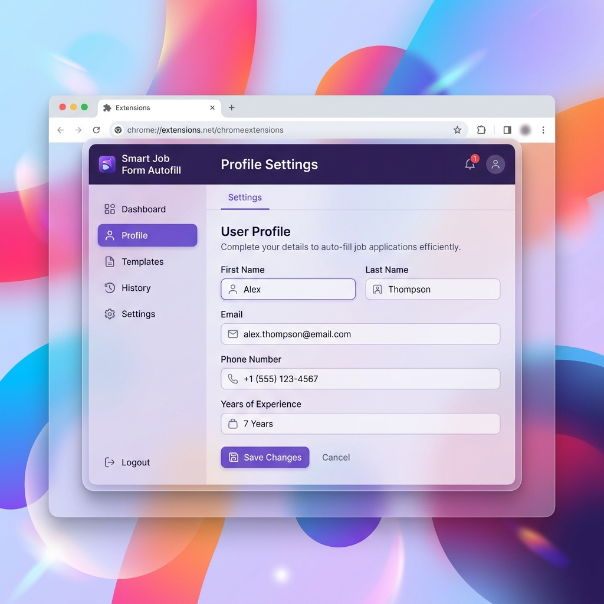

# Smart Job Form Autofill Extension

A smart, privacy-first Chrome Extension designed to automate filling out repetitive job applications. Tailored especially for Data Science and tech roles, with advanced support for dynamic fields, Google Forms, and custom questionnaires.

## Features
- **Smart Field Detection:** Uses fuzzy matching (Fuse.js) to accurately detect input fields even if they have obscure HTML names or IDs.
- **Deep DOM Lookup:** Works flawlessly on deeply nested forms like Google Forms and Workday.
- **Support for Complex Frameworks:** Fully supports React, Angular, and Wiz platforms with native input overrides and value dispatching.
- **Multiple Data Types Supported:** Text fields, Textareas, Dropdowns/Selects, Checkboxes, Radio buttons, and even File Uploads (Resumes/CVs).
- **Custom Q&A:** Allows users to add custom questions (e.g., "Are you legally authorized to work?") and mapped answers, providing flexibility for any unanticipated fields.
- **Local & Secure:** All data is saved strictly to your local browser using `chrome.storage.local`. No data is ever sent to an external server.

## Installation
1. Clone or download this repository.
2. Open Google Chrome.
3. Go to `chrome://extensions/`.
4. Enable **Developer mode** in the top right corner.
5. Click **Load unpacked** and select the directory containing this extension.

## Usage
1. Click the **Thunder** icon in your Chrome toolbar to open the popup.
2. Click **Go to Setup** to open the options page.
3. Fill in your profile details (Personal Info, Education, Experience, Links, etc.).
4. Add any **Custom Questions** you frequently encounter.
5. Upload your Resume file.
6. Hit **Save Profile**.
7. Navigate to a job application or Google Form.
8. Click the extension icon and hit **Auto-Fill Form!**.

## Demo
*(You can capture an animated GIF of the extension in action here and replace this line with ``)*

## Assets
- `icons/icon.png` - The sleek thunder extension icon.
- `images/mockup.png` - Extension mockup preview.
